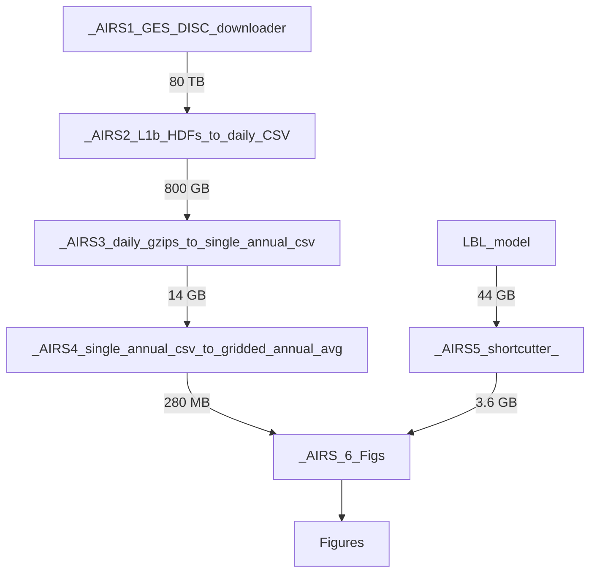

# NS9188K
AIRS/LBL Radiances download + processing tool for AIRS granules stored on https://disc.gsfc.nasa.gov/

### Requirements:
Jupyter (Python 3) dependencies are in the first cell of each workbook. Typically they are available via the usual methods, i.e. `pip install pandas`. The most difficult package to install successfully is `pyhdf`, so the following helpful links are provided:
 - https://hdfeos.org/software/pyhdf.php
 - http://fhs.github.io/pyhdf/install.html
 - https://gist.github.com/protrolium/200ce56b48660f22b0b1b29c6ab8eafd

### Overview:
There are multiple Jupyter notebooks intended to be used sequentially:

 - `_AIRS1_GES_DISC_downloader` accepts a `year` and proceeds to download `.HDF` files from GES DISC. For example, `AIRS.2003.07.04.122.L1B.AIRS_Rad.v5.0.0.0.G07090064822.hdf` is a 55 MB file, and there are 240 per day. One year of AIRS data will take approximately 1 week to download over a 200 MBPS connection and will occupy ~4.5 TB.
 - `_AIRS2_L1b_HDFs_to_daily_CSV` will read in the 4.5 TB/yr of `.HDF` files, extract the clear-sky radiances, and save each day of radiances to a single compressed `.csv.gzp` file (app. 100 MB each).
 - `_AIRS3_daily_gzips_to_single_annual_csv` will read in each of the 100 MB files (containing every individual clear-sky radiance) and create a gridded daily average `.csv.gzp`. Each grid cell contains only the average radiance for that cell. Each annual output file is ~770 MB.
 - `_AIRS4_single_annual_csv_to_gridded_annual_avg` will read in the 770 MB file of gridded daily average radiances for a single year produced by `_AIRS3_` and output monthly averages for each grid cell as a 15 MB `.csv.gzp` file
- `_AIRS5.5_LBL_shortcutter` will read in the 1 GB/yr of gridded monthly average radiances produced by HITRAN and output a single 1 GB file providing all LBL monthly average radiances at a reduced resolution as a `.csv.gzp` file. This script won't work with 8 GB RAM, please use 16 GB RAM to handle 19 yrs of LBL.
- `_AIRS6_figs` will read in the files from _AIRS4 and _AIRS5.5_LBL_shortcutter, perform the trending of yearly averages, and produce the figures in the manuscript.

### How to use:
1. Acquire a username/password for GES DISC Earthdata system `https://www.earthdata.nasa.gov/`
2. In `_AIRS1_.ipynb` the first cell will prompt the user to provide an Earthdata `USERNAME` and `PASSWORD` then will create the 3 files necessary to permit downloading from GES DISC. This action only needs to be executed once, then can be skipped in future iterations.
3. Execute the download cell in `_AIRS1`. If any required local folders do not exist, the program will create them (default is `C:\data\AIRS\L1b\`)
4. In `_AIRS2_.ipynb` set the `folder_L1b` to be the location where the `.HDF` files from `_AIRS1_` are located (specify the root folder that has the \year\ folders) then specify which year(s) and month(s) you want to process. Verify the output (save path at the end) is acceptable. Then run all cells to create daily .csv.gzp files with each clear-sky radiance+lat+lon.
5. In `_AIRS3_.ipynb` set the `files` location where the `.csv.gzp` files are located (from `_AIRS2_`). Verify the output (save path at the end) is acceptable. Then run all cells to create a `2003_dailyavgs.csv.gzp` that is a gridded daily average radiance.
6. In `_AIRS4_.ipynb` set the `files` location where the `.csv.gzp` files are located (from `_AIRS3_`). Verify the output (save path at the end) is acceptable. Then run all cells to create a `2003_lati_lonj.csv.gzp` that is 'i' lat grid cells and 'j' lon grid cells of monthly average radiances for an entire year. The default 20x20 lat x lon will produce 9 lat bands x 18 lon bands.
7. Run the `_AIRS5.5_LBL_Shortcutter` to decompress & process the LBL results from their native `.dat` format to a gzipped `.csv`.
8. In `_AIRS6_.ipynb` set the `folder_AIRS_20x20`, `folder_LBL_20x20`, and `folder_LBL_cfc` to their respective locations. The `AIRS_ir` and `AIRS_vis` files should be placed in the same folder as `_AIRS6.ipynb` (see download links below). Then, run all cells to generate the figures.

### Download Links for AIRS granule in Fig 1:
 - https://airsl1.gesdisc.eosdis.nasa.gov/data/Aqua_AIRS_Level1/AIRIBRAD.005/2021/099/AIRS.2021.04.09.121.L1B.AIRS_Rad.v5.0.25.0.G21100105112.hdf
 - https://airsl1.gesdisc.eosdis.nasa.gov/data/Aqua_AIRS_Level1/AIRVBRAD.005/2021/099/AIRS.2021.04.09.121.L1B.VIS_Rad.v5.0.0.0.G21100104903.hdf
